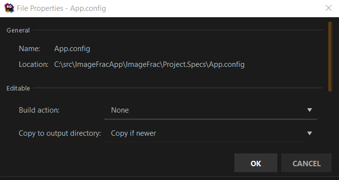
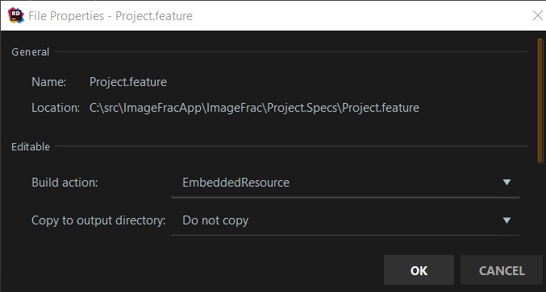

# TickSpec

A lightweight Behaviour Driven Development (BDD) framework for .NET that'll fit how you want to test. (https://github.com/fsprojects/TickSpec)

## How to create a specification project

1. Create an F# class library project.
2. Add the packages to the newly created project:
  - NUnit
  - NUnit3TestAdapter
  - FsUnit
  - TickSpec (**Note**: a .NET framework class library *requires* version 2.0.0-rc1 or later)
3. Add a `App.config` file to the project. Change the properties of the file to be like .
4. Edit `App.config` to redirect bindings to `FSharp.Core` using the following section.
  ```
    <runtime>
        <assemblyBinding xmlns="urn:schemas-microsoft-com:asm.v1">
            <dependentAssembly>
                <assemblyIdentity name="FSharp.Core"
                                  publicKeyToken="b03f5f7f11d50a3a"
                                  culture="en-us" />
                <bindingRedirect oldVersion="0.0.0.0-4.5.0.0" newVersion="4.5.0.0" />
            </dependentAssembly>
        </assemblyBinding>
    </runtime>

  ```
4. Add .feature file specifying the feature, for example, ``Accounts.feature``.
5. Change the properties of the fuature file to be like these properties, .
6. Write the specification for the feature in ``Accounts.feature``.
7. Copy the [`NUnit` feature fixture file](https://github.com/fsprojects/TickSpec/blob/master/Examples/ByFramework/NUnit/FSharp.NUnit/FeatureFixture.fs) into the project.
8. Create a "Steps" file, for example, ``AccountsSteps.fs``.
9. Build the test project **manually**. (This step is required to **generate** the `NUnit` tests.)
10. Run the unit tests in the project. These tests **will** fail.
11. Write the step(s) indicated by the messages from the failing test run.
12. Repeat the previous three steps until all steps implemented.
13. Hopefully your tests pass, but better if they do not. :)

## Trouble shooting

- If running a test reports a missing step definition
  - Ensure that a step definition is a _regular expression_
  - Ensure that each parameter in the step definition is a _regular expression group_ (enclosed in parentheses)
  - Ensure that the step definition has a parameter for each regular expression group
  - Ensure that all changes to your step definition file have been *saved* before compiling / running the steps


